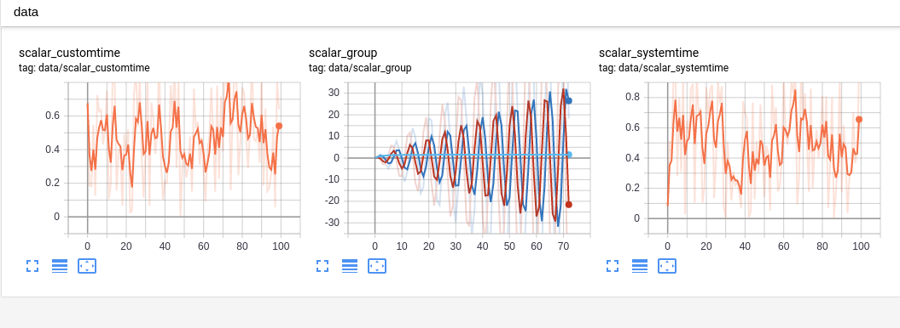

# nnabla_tensorboard

`nnabla_tensorboard` is a tool to help users who use NNabla (Neural Network Libraries [https://nnabla.org/](https://nnabla.org/)) to use TensorBoard as visualization tool.

Uses can write TensorBoard events with simple function call.

* Support `scalar`, `image`, `figure`, `histogram` and `text` summaries.

This project is based on [https://github.com/lanpa/tensorboardX](https://github.com/lanpa/tensorboardX).

## Install

### Requirements

* Python >= 3.6
* nnabla >= v1.0.11
* tensorboard >= 1.13.0

### Build from source

`pip install 'git+https://github.com/naibo-code/nnabla_tensorboard.git'`

Tested on Python 3.7.4 / nnabla 1.3.0 / tensorboard 2.0.1

You can optionally install [`crc32c`](https://github.com/ICRAR/crc32c) to speed up saving a large amount of data.

## Example

* Run the [demo](examples/demo.py) script: `python examples/demo.py`
* Use TensorBoard with `tensorboard --logdir runs`  (needs to install Tensorboard)

## Screenshots

### Scalar Example

### Histogram Example

### Text Example

### Precision-Recall Curve Example

## Reference

* [https://github.com/lanpa/tensorboardX](https://github.com/lanpa/tensorboardX)
